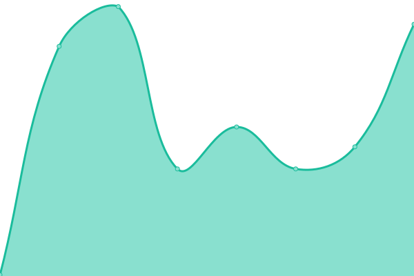

# [📈 Live Status](https://https://theinizio.github.io): <!--live status--> **🟧 Partial outage**

This repository contains the open-source uptime monitor and status page for [theinizio](https://https://theinizio.github.io), powered by [Upptime](https://github.com/upptime/upptime).

With [Upptime](https://upptime.js.org), you can get your own unlimited and free uptime monitor and status page, powered entirely by a GitHub repository. We use [Issues](https://github.com/theinizio/upptime/issues) as incident reports, [Actions](https://github.com/theinizio/upptime/actions) as uptime monitors, and [Pages](https://https://theinizio.github.io) for the status page.

<!--start: status pages-->
<!-- This summary is generated by Upptime (https://github.com/upptime/upptime) -->
<!-- Do not edit this manually, your changes will be overwritten -->
<!-- prettier-ignore -->
| URL | Status | History | Response Time | Uptime |
| --- | ------ | ------- | ------------- | ------ |
|  [DF](https://www.dirtyfans.com) | 🟩 Up | [df.yml](https://github.com/theinizio/uptime/commits/HEAD/history/df.yml) | 

 686ms
     
 | 

<a href="https://https://theinizio.github.io/history/df">100.00%</a>
    

|  [HT](https://www.hashtex.com) | 🟩 Up | [ht.yml](https://github.com/theinizio/uptime/commits/HEAD/history/ht.yml) | 

 181ms
     
 | 

<a href="https://https://theinizio.github.io/history/ht">100.00%</a>
    

|  [HT-CF](https://hashtex.cf) | 🟥 Down | [ht-cf.yml](https://github.com/theinizio/uptime/commits/HEAD/history/ht-cf.yml) | 

 0ms
     
 | 

<a href="https://https://theinizio.github.io/history/ht-cf">0.00%</a>
    

<!--end: status pages-->

[**Visit our status website →**](https://https://theinizio.github.io)

## 📄 License

- Powered by: [Upptime](https://github.com/upptime/upptime)
- Code: [MIT](./LICENSE) © [theinizio](https://https://theinizio.github.io)
- Data in the `./history` directory: [Open Database License](https://opendatacommons.org/licenses/odbl/1-0/)
